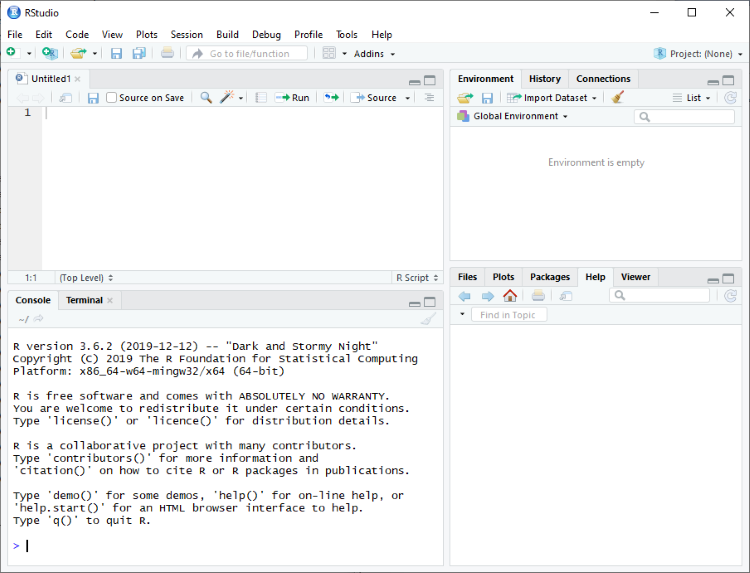
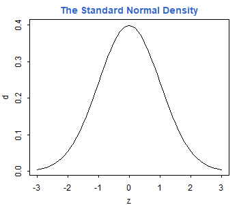
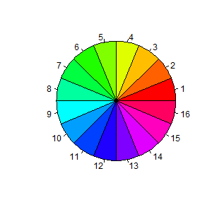

# 2 Getting Started

Obviously the first thing you need to do is download a copy of R. The current version is 3.6.2 and was released in December 2019. New releases occur every six months or so. You will find binaries for Windows, Mac OS X, and Linux in the [Comprehensive R Archive Network](https://cran.r-project.org/). Find the mirror nearest you and follow the links. The Windows installer is fairly easy to use and, after agreeing to the license terms, lets you choose which components you want to install. Additional packages can always be installed directly from R at a later time.

The next thing you should do is install R Studio, a nice Integrated Development Environment (IDE) for R, that is available for Windows, Mac OS X, and Linux. You can download the free open source edition of R Studio Desktop from https://rstudio.com/products/rstudio/. Once the software is installed, it will find and integrate your R installation.



The panel on the lower-left corner of the IDE shows the console, which is described below. Graphs and help will appear on the bottom right panel. The panel on the top left can be used to type an R script to be run later.

If you do not install R Studio, you can still run the R graphical user interface (GUI). I recommend that you create a shorcut on the desktop. When R starts you see a console. Graphs appear on a separate window.

## 2.1 The Console

The console in R Studio (or R) is where you type R expressions and see text results. You are prompted to type some input with the greater than symbol. To quit R Studio (and R) type

```
> q()
```

Note the parentheses after the `q`. This is because in R you do not type commands, but rather call *functions* to achieve results, even quit! To call a function you type the name followed by the arguments in parentheses. If the function takes no arguments, you just type the name followed by left and right parenthesis. (If you forget the parentheses and type just the name of the function, R will list the source code.) After typing `q()` you are asked whether you want to save the current work environment. You can skip this prompt by typing `q("no")`.

You should also know about the `help()` function, which uses the window on the bottom right (opens a separate help window in R). The function can be called with arguments to obtain help about specific features of R, for example `help(plot)`. A shortcut for help on a topic is a question mark followed by the topic, as in `?plot`.

The console allows input editing. You will find that the left and right arrow keys, home, end, backspace, insert, and delete work exactly as you would expect. You also get an input history: the up and down arrow keys can be used to scroll through recent input lines. Thus, if you make a mistake, all you need to do is press the up key to recall your last expression and edit it.

You can also type a script on the top left window of R Studio and then click on “Run”.

## 2.2 Expressions and Assignments

R works like a calculator, you type an expression and get the answer:

```
> 1 + 2
[1] 3
```

The standard arithmetic operators are `+`, `-`, `*`, and `/` for add, subtract, multiply and divide, and `^` for exponentiation, so `2^3 = 8`. These operators have the standard precedence, with exponentiation highest and addition/subtraction lowest, but you can always control the order of evaluation with parentheses. You can use mathematical functions, such as `sqrt()`, `exp()`, and `log()`. For example

```
> log(0.3/(1 - 0.3))
[1] -0.8472979
```

R also understands the relational operators `<=`, `<`, `==`, `>`, `>=` and `!=` for less than or equal, less than, equal, greater than, greater than or equal, and not equal. These can be used to create logical expressions that take values `TRUE` and `FALSE` (or `T` and `F` for short). Logical expressions may be combined with the logical operators `|` for OR and `&` for AND, as shown further below.

The results of a calculation may be assigned to a named object. The assignment operator in R is `<-`, read as “gets”, but by popular demand R now accepts the equal sign as well, so `x <- 2` and `x = 2` both assign the value 2 to a variable (technically an object) named `x`.

Typing a name prints its contents. The name `pi` is used for the constant π. Thus,

```
> s = pi/sqrt(3)
```

assigns π/3 to the variable `s` and prints its value.

Names may contain letters, numbers or periods, and (starting with 1.9.0) the underscore character, but must start with a letter or period. (I recommend you always start names with a letter.) Thus, `v.one` and `v_one` are valid names, but `v one` is not (because it includes a space).

*Warning*: R is case sensitive, `v.one`, `V.one` and `v.One` are all different names.

R objects exist during your session but vanish when you exit. However, as noted earlier you will be asked if you want to save an image of your workspace before you leave. You can also save individual objects to disk, see `help(save)`.

Note that assignments are expressions too; you can type x <- y <- 2 and both x and y will get 2. This works because the assignment y <- 2 is also an expression that takes the value 2.

*Exercise*: What’s the difference between `x == 2` and `x = 2`? Use the console to find out.

## 2.3 Vectors and Matrices

So far we have worked with scalars (single numbers) but R is designed to work with **vectors** as well. The function `c()`, which is short for catenate (or concatenate if you prefer) can be used to create vectors from scalars or other vectors

```
> x <- c(1, 3, 5, 7)
> x
[1] 1 3 5 7
```

The colon operator `:` can be used to generate a sequence of numbers

```
> x <- 1:10
> x
 [1]  1  2  3  4  5  6  7  8  9 10
```

You can also use the `seq()` function to create a sequence given the starting and stopping points and an increment. For example here are eleven values between 0 and 1 in steps of 0.1:

```
> seq(0, 1, 0.1)
 [1] 0.0 0.1 0.2 0.3 0.4 0.5 0.6 0.7 0.8 0.9 1.0
```

Another function that is useful in creating vectors is `rep()` for repeat or replicate. For example `rep(3, 4)` replicates the number three four times. The first argument can be a vector, so `rep(x, 3)` replicates the entire vector `x` three times. If both arguments are vectors of the same size, then each element of the first vector is replicated the number of times indicated by the corresponding element in the second vector. Consider this example:

```
> rep(1:3, 2)
[1] 1 2 3 1 2 3
> rep(1:3, c(2, 2, 2))
[1] 1 1 2 2 3 3
```

The first call repeats the vector `1:3` twice. The second call repeats each element of `1:3` twice, and could have been written `rep(1:3, rep(2, 3)`), a common R idiom.

R operations are vectorized. If `x` is a vector, then `log(x)` is a vector with the logs of the elements of `x`. Arithmetic and relational operators also work element by element. If `x` and `y` are vectors of the same length, then `x + y` is a vector with elements equal to the sum of the corresponding elements of `x` and `y`. If `y` is a scalar, it is added to each element of `x`. If `x` and `y` are vectors of different lengths, the shorter one is recycled as needed, perhaps a fractional number of times (in which case you get a warning).

The logical operators `|` for *or* and `&` for *and* also work element by element. (The double operators `||` for *or* and `&&` for *and* work only on the first element of each vector, and use shortcut evaluation; they are used mostly in writing R functions, and will not be discussed further.)

```
> a = c(TRUE, TRUE, FALSE, FALSE)
> b = c(TRUE, FALSE, TRUE, FALSE)
> a & b
[1]  TRUE FALSE FALSE FALSE
```

The number of elements of a vector is returned by the function `length()`. Individual elements are addressed using subscripts in square brackets, so `x[1]` is the first element of `x`, `x[2]` is the second, and `x[length(x)]` is the last.

The subscript can be a vector itself, so `x[1:3]` is a vector consisting of the first three elements of `x`. A negative subscript *excludes* the corresponding element, so `x[-1]` returns a vector with all elements of `x` except the first one.

Interestingly, a subscript can also be a logical expression, in which case you get the elements for which the expression is `TRUE`. For example, to list the elements of `x` that are less than `5` we write

```
> x[x < 5]
[1] 1 2 3 4
```

I read this expression “x such that x is less than 5”. That works because the subscript `x < 5` is this vector

```
> x < 5
 [1]  TRUE  TRUE  TRUE  TRUE FALSE FALSE FALSE FALSE FALSE FALSE
```

R’s subscripting facility is extremely powerful. You may find that it takes a while to get used to it, but eventually the language becomes natural.

R also understands **matrices** and higher dimensional arrays. The following function creates a 3 by 4 matrix and fills it by columns with the numbers 1 to 12:

```
> M = matrix(1:12, 3, 4)
> M
     [,1] [,2] [,3] [,4]
[1,]    1    4    7   10
[2,]    2    5    8   11
[3,]    3    6    9   12
```

The elements of a matrix may be addressed using the row and column subscripts in square brackets, separated by a command. Thus, `M[1, 1]` is the first element of `M` (in row 1 and column 1).

A subscript may be left blank to select an entire row or column: `M[1,]` is the first row, and `M[,1]` is the first column. Any of the subscripts may be a vector, so `M[1:2, 1:2]` is the upper-left 2 by 2 corner of `M`. Try it.

The number of rows and columns of a matrix are returned by the functions `nrow()` and `ncol()`. To transpose a matrix use the function `t()`. The matrix multiplication operator is `%*%`. Matrix inversion is done by the function `solve()`. See the linear regression section for an example.

*Exercise*: How do you list the last element of a matrix?

## 2.4 Simple Graphs

R has very extensive and powerful graphic facilities. In the example below we use `seq()` to create equally spaced points between -3 and 3 in steps of 0.1 (that’s 61 points). Then we call the function `dnorm()` to calculate the standard normal density evaluated at those points, we plot it, and add a title in a nice shade of blue. Note that we are able to add the title to the current plot in a separate call.

```
> z = seq(-3, 3, 0.1)
> d = dnorm(z)
> plot(z, d, type="l")
> title("The Standard Normal Density", col.main="#3366cc")
```



Arguments to a function can be specified by position or by name. The `plot()` function expects the first two arguments to be vectors giving the `x` and `y` coordinates of the points to be plotted. We also specified the `type` of plot. Since this is one of many optional parameters (type `?plot` for details), we specified it by name as `type="l"` (the letter el). This indicates that we want the points joined to form a line, rather than the default which is to plot discrete points. Note that R uses the equal sign to specify named arguments to a function.

The `title()` function expects a character string with the title as the first argument. We also specified the optional argument `col.main="#3366c"` to set the color of the title. Here I specified the red, green and blue components of the color in hexadecimal notation; this particular choice matches the headings on my website. There are also 657 named colors to choose from, type `colors()` to see their names.

The next example is based on a demo included in the R distribution, and is simply meant to show off R’s use of colors. We use the `pie()` function to create a chart with 16 slices. The slices are all the same width, but we fill them with different colors obtained using the `rainbow()` function.

```
> pie(rep(1, 16), col = rainbow(16))
```



Note the use of the rep function to replicate the number one 16 times. To see how one can specify colors and labels for the slices, try calling pie with arguments `1:4`, `c("r", "g", "b","w")` and `col = c("red,"green","blue","white")`.

To save a graph in R Studio click on the “Export” button on the graph window. (In R make sure the focus is on the graph window and choose `File | Save as`, from the menu.) You can save as an Image or a PDF file.

One of the image formats is `png`, which makes it easy to include R graphs in web pages. R also supports `jpeg`, but I think `png` is better than `jpeg` for statistical plots. All graphs on the web version of this tutorial are in `png` format.

Alternatively, you can copy the graph to the clipboard by choosing “Clipboard”. (In R select `File | Copy to clipboard`.) You get a choice of two formats: bitmap and metafile. I recommend that you use the metafile format because it’s more flexible. You can then paste the graph into a word processing or spreadsheet document. (In R you can also print the graph using `File | Print`).

*Exercise*: Simulate 20 observations from the regression model Y=α+βx+e using the `x` vector generated above. Set α=1 and β=2. Use standard normal errors generated as `rnorm(20)`, where 20 is the number of observations.