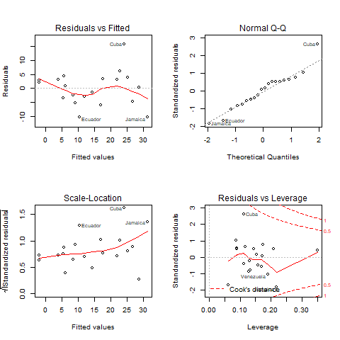

# 4 Linear Models

Let us try some linear models, starting with multiple regression and analysis of covariance models, and then moving on to models using regression splines. In this section I will use the data read in Section 3, so make sure the `fpe` data frame is still available.

## 4.1 Fitting a Model

To fit an ordinary linear model with fertility change as the response and setting and effort as predictors, try

```
> lmfit = lm( change ~ setting + effort, data = fpe )
```

Note first that `lm()` is a function, and we assign the result to an object that I choose to call `lmfit` (for linear model fit). This stores the results of the fit for later examination.

The first argument to `lm()` is a model formula, which has the response on the left of the tilde `~` (read “is modeled as”), and a Wilkinson-Rogers model specification formula on the right. R uses

```
+` to combine elementary terms, as in `A + B` `:` for interactions, as in `A:B`; `*` for both main effects and interactions, so `A * B = A + B + A:B
```

A nice feature of R is that it lets you create interactions between categorical variables, between categorical and continuous variables, and even between numeric variables (it just creates the cross-product).

We also used the `data` argument to specify the data frame containing these variables.

## 4.2 Examining a Fit

Let us look at the results of the fit. One thing you can do with `lmfit`, as you can with any R object, is print it.

```
> lmfit
Call:
lm(formula = change ~ setting + effort, data = fpe)

Coefficients:
(Intercept)      setting       effort  
   -14.4511       0.2706       0.9677  
```

The output includes the model formula and the coefficients. You can get a bit more detail by using the `summary()` function:

```
> summary(lmfit)
Call:
lm(formula = change ~ setting + effort, data = fpe)

Residuals:
     Min       1Q   Median       3Q      Max 
-10.3475  -3.6426   0.6384   3.2250  15.8530 

Coefficients:
            Estimate Std. Error t value Pr(>|t|)    
(Intercept) -14.4511     7.0938  -2.037 0.057516 .  
setting       0.2706     0.1079   2.507 0.022629 *  
effort        0.9677     0.2250   4.301 0.000484 ***
---
Signif. codes:  0 '***' 0.001 '**' 0.01 '*' 0.05 '.' 0.1 ' ' 1

Residual standard error: 6.389 on 17 degrees of freedom
Multiple R-squared:  0.7381,    Adjusted R-squared:  0.7073 
F-statistic: 23.96 on 2 and 17 DF,  p-value: 1.132e-05
```

The output includes a more conventional table with parameter estimates and standard errors, as well the residual standard error and multiple R-squared. (You could also get the matrix of correlations among parameter estimates, by adding the option `correlation = TRUE` in the call to `summary()`, but that is a bit too much detail.)

To get a hierarchical analysis of variance table corresponding to introducing each of the terms in the model one at a time, in the same order as in the model formula, try the `anova()` function:

```
> anova(lmfit)
Analysis of Variance Table

Response: change
          Df  Sum Sq Mean Sq F value    Pr(>F)    
setting    1 1201.08 1201.08  29.421 4.557e-05 ***
effort     1  755.12  755.12  18.497 0.0004841 ***
Residuals 17  694.01   40.82                      
---
Signif. codes:  0 '***' 0.001 '**' 0.01 '*' 0.05 '.' 0.1 ' ' 1
```

Alternatively, you can plot the results using

```
plot(lmfit)
```

This will produce a set of four plots: residuals versus fitted values, a Q-Q plot of standardized residuals, a scale-location plot (square roots of standardized residuals versus fitted values, and a plot of residuals versus leverage, that adds bands corresponding to Cook’s distances of 0.5 and 1.

R Studio (and R) will prompt you to press Enter before showing each graph, but we can do better. Type `par(mfrow = c(2, 2))` to set your graphics window to show four plots at once, in a layout with 2 rows and 2 columns. Then redo te graph using `plot(lmfit)`. To go back to a single graph per window use `par(mfrow = c(1, 1))`. There are many other ways to customize your graphs by setting high-level parameters, type `?par` to learn more.



*Technical Note*: You may have noticed that we have used the function `plot()` with all kinds of arguments: one or two variables, a data frame, and now a linear model fit. In R jargon, `plot()` is a generic function. It checks for the kind of object that you are plotting, and then calls the appropriate (more specialized) function to do the work. There are actually many plot functions in R, including `plot.data.frame()` and `plot.lm()`. For most purposes, the generic function will do the right thing and you don’t need to be concerned about its inner workings.

## 4.3 Extracting Results

There are some specialized functions that allow you to extract elements from a linear model fit. For example

```
> fitted(lmfit)
       Bolivia         Brazil          Chile       Colombia      CostaRica 
     -2.004026       5.572452      25.114699      21.867637      28.600325 
          Cuba   DominicanRep        Ecuador     ElSalvador      Guatemala 
     24.146986      17.496913      10.296380      14.364491       9.140694 
         Haiti       Honduras        Jamaica         Mexico      Nicaragua 
     -2.077359       6.122912      31.347518      11.878604       3.948921 
        Panama       Paraguay           Peru TrinidadTobago      Venezuela 
     26.664898       8.475593       5.301864      22.794043      16.946453 
```

extracts the fitted values. In this case it will also print them, because we did not asign them to anything. (The longer form `fitted.values()` is an alias.)

To extract the coefficients use the `coef()` function (or the longer form `coefficients()`)

```
> coef(lmfit)
(Intercept)     setting      effort 
-14.4510978   0.2705885   0.9677137 
```

To get the residuals, use the `resids()` function (or the longer form `residuals()`). There is a `type` argument that lets you choose several types of residuals, type `?residuals.lm` for information. I find more useful the `rstudent()` functions that returns standardized residuals:

```
> rstudent(lmfit)
       Bolivia         Brazil          Chile       Colombia      CostaRica 
    0.51666939     0.75316960     0.63588630     0.50233619     0.06666317 
          Cuba   DominicanRep        Ecuador     ElSalvador      Guatemala 
    3.32236668     0.56318276    -1.76471053    -0.22267614    -0.85483603 
         Haiti       Honduras        Jamaica         Mexico      Nicaragua 
    0.39308668     0.14477900    -1.98177567    -0.47988042     0.50479726 
        Panama       Paraguay           Peru TrinidadTobago      Venezuela 
   -0.77508737    -0.40082283    -0.55507263     1.01832414    -1.03565220 
```

If you are curious to see exactly what a linear model fit produces, try the function

```
> names(lmfit)
 [1] "coefficients"  "residuals"     "effects"       "rank"         
 [5] "fitted.values" "assign"        "qr"            "df.residual"  
 [9] "xlevels"       "call"          "terms"         "model"        
```

which lists the named components of a linear fit. All of these objects may be extracted using the `$` operator. However, if there is a special extractor function such as `coef()` or `resid()`, you are encouraged to use it.

## 4.4 Factors and Covariates

So far our predictors have been continuous variables or *covariates*. We can also use categorical variables or *factors*. Let us group family planning effort into three categories:

```
> fpe$effortg = cut(fpe$effort, breaks = c(-1, 4, 14, 100), 
+   label = c("weak", "moderate", "strong"))
```

The function `cut()` creates a factor or categorical variable. The first argument is an input vector, the second is a vector of breakpoints, and the third is a vector of category labels. Note that there is one more breakpoint than there are categories. All values greater than the *i*-th breakpoint and less than or equal to the *(i+1)*-st breakpoint go into the *i*-th category. Any values below the first breakpoint or above the last one are coded `NA` (a special R code for missing values). If the labels are omitted, R generates a suitable default of the form “(a, b]”. By default the intervals are closed on the right, so our intervals are ≤4, 5 - 14, and 15+. To change this behavior, use the option `right = FALSE`.

Note that by specifying `fpe$effortg` on the left-hand-side, we have effectively added a new column to the `fpe` data frame.

Try fitting the analysis of covariance model:

```
> covfit = lm( change ~ setting + effortg, data = fpe)
> covfit
Call:
lm(formula = change ~ setting + effortg, data = fpe)

Coefficients:
    (Intercept)          setting  effortgmoderate    effortgstrong  
        -5.9540           0.1693           4.1439          19.4476  
```

As you can see, `effortg` has been treated automatically as a factor, and R has generated the necessary dummy variables for “moderate” and “strong” programs, treating “weak”" as the reference cell.

*Choice of Contrasts*: R codes unordered factors using the reference cell or “treatment contrast” method. The reference cell is always the first category which, depending on how the factor was created, is usually the first in alphabetical order. If you don’t like this choice, R provides a special function to re-order levels, check out `help(relevel)`.

You can obtain a hierarchical anova table for the analysis of covariance model using the `anova()` function:

```
> anova(covfit)
Analysis of Variance Table

Response: change
          Df  Sum Sq Mean Sq F value    Pr(>F)    
setting    1 1201.08 1201.08  36.556 1.698e-05 ***
effortg    2  923.43  461.71  14.053 0.0002999 ***
Residuals 16  525.69   32.86                      
---
Signif. codes:  0 '***' 0.001 '**' 0.01 '*' 0.05 '.' 0.1 ' ' 1
```

Type `?anova` to learn more about this function.

## 4.5 Regression Splines

The real power of R begins to shine when you consider some of the other functions you can include in a model formula. First, you can include mathematical functions, for example `log(setting)` is a perfectly legal term in a model formula. You don’t have to create a variable representing the log of setting and then use it, R will create it ‘on the fly’, so you can type

```
> lm( change ~ log(setting) + effort, data = fpe)
Call:
lm(formula = change ~ log(setting) + effort, data = fpe)

Coefficients:
 (Intercept)  log(setting)        effort  
     -61.737        15.638         1.002  
```

If you wanted to use orthogonal polynomials of degree 3 on setting, you could include a term of the form `poly(setting, 3)`.

You can also get R to calculate a well-conditioned basis for regression splines. First you must load the `splines` library.

```
> library(splines)
```

This makes available the function `bs()~ to generate B-splines. For example the call

```
> fpe$setting.bs = bs(fpe$setting, knots = c(66, 74, 84))
```

will generate cubic B-splines with interior knots placed at 66, 74 and 84. This basis will use seven degrees of freedom, four corresponding to the constant, linear, quadratic and cubic terms, plus one for each interior knot. Alternatively, you may specify the number of degrees of freedom you are willing to spend on the fit using the parameter `df`. For cubic splines R will choose df-4 interior knots placed at suitable quantiles. You can also control the degree of the spline using the parameter `degree`, the default being cubic.

If you like natural cubic splines, you can obtain a well-conditioned basis using the function `ns()`, which has exactly the same arguments as `bs()` except for `degree`, which is always three. To generate a natural spline with five degrees of freedom, use the call

```
> fpe$setting.ns = ns(fpe$setting, df=5)
```

Natural cubic splines are better behaved than ordinary splines at the extremes of the range. The restrictions mean that you save four degrees of freedom. You will probably want to use two of them to place additional knots at the extremes, but you can still save the other two.

To fit an additive model to fertility change using natural cubic splines on setting and effort with only one interior knot each, placed exactly at the median of each variable, try the following call:

```
> splinefit = lm( change ~ ns(setting, knot=median(setting)) + 
+   ns(effort, knot=median(effort)), data = fpe )
```

Here we used the parameter `knot` to specify where we wanted the knot placed, and the function `median()` to calculate the median of setting and effort. All calculations are done “on the fly”.

Do you think the spline model is a good fit? Natural cubic splines with exactly one interior knot require the same number of parameters as an ordinary cubic polynomial, but are much better behaved at the extremes.

## 4.6 Other Options

The `lm()` function has several additional parameters that we have not discussed. These include

`subset` to restrict the analysis to a subset of the data `weights` to do weighted least squares

and many others; see `help(lm)` for further details. The `args()` function lists the arguments used by any function, in case you forget them. Try `args(lm)`.

The fact that R has powerful matrix manipulation routines means that one can do many of these calculations from first principles. The next couple of lines create a model matrix to represent the constant, setting and effort, and then calculate the OLS estimate of the coefficients as (X′X)−1X′y:

```
> X <- cbind(1, fpe$effort, fpe$setting)
> solve( t(X) %*% X ) %*% t(X) %*% fpe$change
            [,1]
[1,] -14.4510978
[2,]   0.9677137
[3,]   0.2705885
```

Compare these results with `coef(lmfit)`.