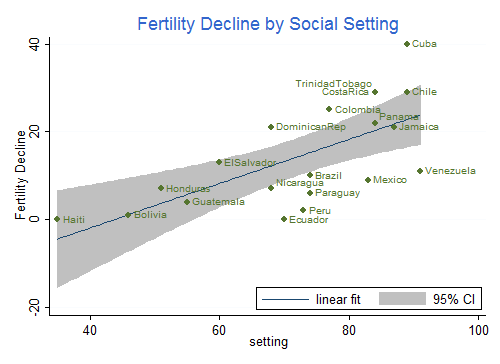
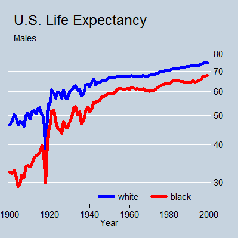
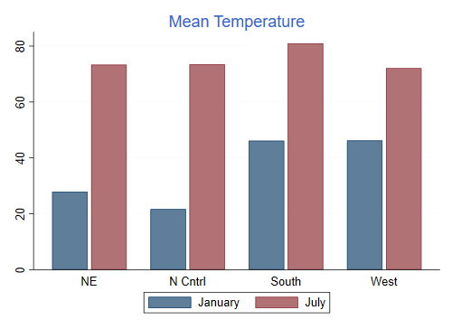
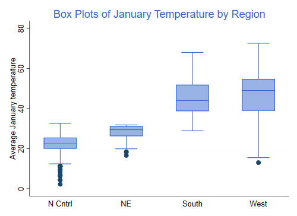

# 3 Stata Graphics

Stata has excellent graphic facilities, accessible through the `graph` command, see `help graph` for an overview. The most common graphs in statistics are X-Y plots showing points or lines. These are available in Stata through the `twoway` subcommand, which in turn has many sub-subcommands or plot types, the most important of which are `scatter` and `line`. I will also describe briefly bar plots, available through the `bar` subcommand, and other plot types.

Stata 10 introduced a graphics editor that can be used to modify a graph interactively. I do not recomment this practice, however, because it conflicts with the goals of documenting and ensuring reproducibility of all the steps in your research.

All the graphs in this section (except where noted) use a custom scheme with blue titles and a white background, but otherwise should look the same as your own graphs. I discuss schemes in Section 3.2.5.

## 3.1 Scatterplots

In this section I will illustrate a few plots using the data on fertility decline first used in Section 2.1. To read the data from net-aware Stata type

```
. infile str14 country setting effort change ///
>     using https://data.princeton.edu/wws509/datasets/effort.raw, clear
(20 observations read)
```

To whet your appetite, here’s the plot that we will produce in this section:



### 3.1.1 A Simple Scatterplot

To produce a simple scatterplot of fertility change by social setting you use the command

```
graph twoway scatter change setting 
```

Note that you specify `y` first, then `x`. Stata labels the axes using the variable labels, if they are defined, or variable names if not. The command may be abbreviated to `twoway scatter`, or just `scatter` if that is the only plot on the graph. We will now add a few bells and whistles.

### 3.1.2 Fitted Lines

Suppose we want to show the fitted regression line as well. In some packages you would need to run a regression, compute the fitted line, and then plot it. Stata can do all that in one step using the `lfit` plot type. (There is also a `qfit` plot for quadratic fits.) This can be combined with the scatter plot by enclosing each sub-plot in parenthesis. (One can also combine plots using two horizontal bars `||` to separate them.)

```
graph twoway (scatter setting effort) ///
             (lfit setting effort)
```

Now suppose we wanted to put confidence bands around the regression line. Stata can do this with the `lfitci` plot type, which draws the confidence region as a gray band. (There is also a `qfitci` band for quadratic fits.) Because the confidence band can obscure some points we draw the region first and the points later

```
graph twoway (lfitci setting effort) ///
             (scatter setting effort) 
```

Note that this command doesn’t label the y-axis but uses a legend instead. You could specify a label for the y-axis using the `ytitle()` option, and omit the (rather obvious) legend using `legend(off)`. Here we specify both as options to the `twoway` command. To make the options more obvious to the reader, I put the comma at the start of a new line:

```
graph twoway (lfitci setting effort) ///
             (scatter setting effort) ///
           , ytitle("Fertility Decline") legend(off)
```

### 3.1.3 Labeling Points

There are many options that allow you to control the markers used for the points, including their shape and color, see `help marker_options`. It is also possible to label the points with the values of a variable, using the `mlabel(varname)` option. In the next step we add the country names to the plot:

```
graph twoway (lfitci change setting) ///
             (scatter change setting, mlabel(country) ) 
```

One slight problem with the labels is the overlap of Costa Rica and Trinidad Tobago (and to a lesser extent Panama and Nicaragua). We can solve this problem by specifying the position of the label relative to the marker using a 12-hour clock (so 12 is above, 3 is to the right, 6 is below and 9 is to the left of the marker) and the `mlabv()` option. We create a variable to hold the position set by default to 3 o’clock and then move Costa Rica to 9 o’clock and Trinidad Tobago to just a bit above that at 11 o’clock (we can also move Nicaragua and Panama up a bit, say to 2 o’clock):

```SAS
. gen pos=3

. replace pos = 11 if country == "TrinidadTobago"
(1 real change made)

. replace pos = 9 if country == "CostaRica"
(1 real change made)

. replace pos = 2 if country == "Panama" | country == "Nicaragua"
(2 real changes made)
```

The command to generate this version of the graph is as follows

```
graph twoway (lfitci change setting) ///
             (scatter change setting, mlabel(country) mlabv(pos) ) 
```

### 3.1.4 Titles, Legends and Captions

There are options that apply to all two-way graphs, including titles, labels, and legends. Stata graphs can have a `title()` and `subtitle()`, usually at the top, and a `legend()`, `note()` and `caption()`, usually at the bottom, type `help title_options` to learn more. Usually a title is all you need. Stata 11 allows text in graphs to include bold, italics, greek letters, mathematical symbols, and a choice of fonts. Stata 14 introduced Unicode, greatly expanding what can be done. Type `help graph text` to learn more.

Our final tweak to the graph will be to add a legend to specify the linear fit and 95% confidence interval, but not fertility decline itself. We do this using the `order(2 "linear fit" 1 "95% CI")` option of the legend to label the second and first items in that order. We also use `ring(0)` to move the legend inside the plotting area, and `pos(5)` to place the legend box near the 5 o’clock position. Our complete command is then

```
. graph twoway (lfitci change setting) ///
>          (scatter change setting, mlabel(country) mlabv(pos) ) ///
>        , title("Fertility Decline by Social Setting") ///
>          ytitle("Fertility Decline") ///
>          legend(ring(0) pos(5) order(2 "linear fit" 1 "95% CI")) 

. graph export fig31.png, width(500) replace             
(file fig31.png written in PNG format)
```

The result is the graph shown at the beginning of this section.

### 3.1.5 Axis Scales and Labels

There are options that control the scaling and range of the axes, including `xscale()` and `yscale()`, which can be arithmetic, log, or reversed, type `help axis_scale_options` to learn more. Other options control the placing and labeling of major and minor ticks and labels, such as as `xlabel()`, `xtick()` and `xmtick()`, and similarly for the y-axis, see `help axis_label_options`. Usually the defaults are acceptable, but it’s nice to know that you can change them.

## 3.2 Line Plots

I will illustrate line plots using data on U.S. life expectancy, available as one of the datasets shipped with Stata. (Try `sysuse dir` to see what else is available.)

```
. sysuse uslifeexp, clear
(U.S. life expectancy, 1900-1999)
```

The idea is to plot life expectancy for white and black males over the 20th century. Again, to whet your appetite I’ll start by showing you the final product, and then we will build the graph bit by bit.



### 3.2.1 A Simple Line Plot

The simplest plot uses all the defaults:

```
graph twoway line le_wmale le_bmale year 
```

If you are puzzled by the dip before 1920, Google “US life expectancy 1918”. We could abbreviate the command to `twoway line`, or even `line` if that’s all we are plotting. (This shortcut only works for `scatter` and `line`.)

The `line` plot allows you to specify more than one “y” variable, the order is y1, y2, …, ym, x. In our example we specified two, corresponding to white and black life expectancy. Alternatively, we could have used two line plots: `(line le_wmale year) (line le_bmale year)`.

### 3.2.2 Titles and Legends

The default graph is quite good, but the legend seems too wordy. We will move most of the information to the title and keep only ethnicity in the legend:

```
graph twoway line le_wmale le_bmale year ///
    , title("U.S. Life Expectancy") subtitle("Males") ///
      legend( order(1 "white" 2 "black") )
```

Here I used three options, which as usual in Stata go after a comma: `title`, `subtitle` and `legend`. The `legend` option has many sub options; I used `order` to list the keys and their labels, saying that the first line represented whites and the second blacks. To omit a key you just leave it out of the list. To add text without a matching key use a hyphen (or minus sign) for the key. There are many other legend options, see `help legend_option` to learn more.

I would like to use space a bit better by moving the legend inside the plot area, say around the 5 o’clock position, where improving life expectancy has left some spare room. As noted earlier we can move the legend inside the plotting area by using `ring(0)`, the “inner circle”, and place it near the 5 o’clock position using `pos(5)`. Because these are legend sub-options they have to go *inside* `legend()`:

```
graph twoway line le_wmale le_bmale year ///
    , title("U.S. Life Expectancy") subtitle("Males") ///
      legend( order(1 "white" 2 "black") ring(0) pos(5) )
```

### 3.2.3 Line Styles

I don’t know about you, but I find hard to distinguish the default lines on the plot. Stata lets you control the line style in different ways. The `clstyle()` option lets you use a named style, such as `foreground`, `grid`, `yxline`, or `p1-p15` for the styles used by lines 1 to 15, see `help linestyle`. This is useful if you want to pick your style elements from a *scheme*, as noted further below.

Alternatively, you can specify the three components of a style: the line pattern, width and color:

- Patterns are specified using the `clpattern()` option. The most common patterns are `solid`, `dash`, and `dot`; see `help linepatternstyle` for more information.

- Line width is specified using `clwidth()`; the available options include `thin`, `medium` and `thick`, see `help linewidthstyle` for more.

- Colors can be specified using the `clcolor()` option using color names (such as `red`, `white` and `blue`, `teal`, `sienna`, and many others) or RGB values, see `help colorstyle`.

Here’s how to specify blue for whites and red for blacks:

```
graph twoway (line le_wmale le_bmale year , clcolor(blue red) ) ///
        , title("U.S. Life Expectancy") subtitle("Males") ///
        legend( order(1 "white" 2 "black") ring(0) pos(5)) 
```

Note that `clcolor()` is an option of the line plot, so I put parentheses round the `line` command and inserted it there.

### 3.2.4 Scale Options

It looks as if improvements in life expectancy slowed down a bit in the second half of the century. This can be better appreciated using a log scale, where a straight line would indicate a constant percent improvement. This is easily done using the axis options of the two-way command, see `help axis_options`, and in particular `yscale()`, which lets you choose `arithmetic`, `log`, or `reversed` scales. There’s also a suboption `range()` to control the plotting range. Here I will specify the y-range as 25 to 80 to move the curves a bit up:

```
. graph twoway (line le_wmale le_bmale year , clcolor(blue red) ) ///
>     , title("U.S. Life Expectancy") subtitle("Males") ///
>     legend( order(1 "white" 2 "black") ring(0) pos(5)) ///
>     yscale(log range(25 80))
```

### 3.2.5 Graph Schemes

Stata uses schemes to control the appearance of graphs, see `help scheme`. You can set the default scheme to be used in all graphs with `set scheme_name`. You can also redisplay the (last) graph using a different scheme with `graph display, scheme(scheme_name`).

To see a list of available schemes type `graph query, schemes`. Try `s2color` for screen graphs, `s1manual` for the style used in the Stata manuals, and `economist` for the style used in *The Economist*. Using the latter we obtain the graph shown at the start of this section.

```
. graph display, scheme(economist)

. graph export fig32.png, width(400) replace
(file fig32.png written in PNG format)
```

## 3.3 Other Graphs

I conclude the graphics section discussing bar graphs, box plots, and kernel density plots using area graphs with transparency.

### 3.3.1 Bar Graphs

Bar graphs may be used to plot the frequency distribution of a categorical variable, or to plot descriptive statistics of a continuous variable within groups defined by a categorical variables. For our examples we will use the city temperature data that ships with Stata.

If I was to just type `graph bar, over(region)` I would obtain the frequency distribution of the region variable. Let us show instead the average temperatures in January and July. To do this I could specify `(mean) tempjan (mean) tempjuly`, but because the default statistic is the mean I can use the shorter version below. I think the default legend is too long, so I also specified a custom one.

I use `over()` so the regions are overlaid in the same graph; using `by()` instead, would result in a graph with a separate panel for each region. The `bargap()` option controls the gap between bars for different statistics in the same over group; here I put a small space. The `gap()` option, not used here, controls the space between bars for different over groups. I also set the intensity of the color fill to 70%, which I think looks nicer.

```
. sysuse citytemp, clear
(City Temperature Data)

. graph bar tempjan tempjul, over(region) bargap(10) intensity(70) ///
>     title(Mean Temperature) legend(order(1 "January" 2 "July")) 

. graph export bar.png, width(500) replace
(file bar.png written in PNG format)
```



Obviously the north-east and north-central regions are much colder in January than the south and west. There is less variation in July, but temperatures are higher in the south.

### 3.3.2 Box Plots

A quick summary of the distribution of a variable may be obtained using a “box-and-wiskers” plot, which draws a box ranging from the first to the third quartile, with a line at the median, and adds “wiskers” going out from the box to the adjacent values, defined as the highest and lowest values that are no farther from the median than 1.5 times the inter-quartile range. Values further out are outliers, indicated by circles.

Let us draw a box plot of January temperatures by region. I will use the `over(region)` option, so the boxes will be overlaid in the same graph, rather than `by(region)`, which would produce a separate panel for each region. The option `sort(1)` arranges the boxes in order of the median of `tempjan`, the first (and in this case only) variable. I also set the box color to a nice blue by specifying the Red, Blue and Green (RGB) color components in a scale of 0 to 255:

```
. graph box tempjan, over(region, sort(1)) box(1, color("51 102 204")) ///
>     title(Box Plots of January Temperature by Region)

. graph export boxplot.png, width(500) replace
(file boxplot.png written in PNG format)
```



We see that January temperatures are lower and less variable in the north-east and north-central regions, with quite a few cities with unusually cold averages.

### 3.3.3 Kernel Density Estimates

A more detailed view of the distribution of a variable may be obtained using a smooth histogram, calculated using a kernel density smoother using the `kdensity` command.

Let us run separate kernel density estimates for January temperatures in each region using all the defaults, and save the results.

```
. forvalues i=1/4 {
  2.     capture drop x`i' d`i'
  3.     kdensity tempjan if region== `i', generate(x`i'  d`i')
  4. }

. gen zero = 0
```

Next we plot the density estimates using area plots with a floor at zero. Because the densities overlap, I use the new opacity option introduced in Stata 15 to make them 50% transparent. In this case I used color names, followed by a `%` symbol and the opacity. I also simplify the legend a bit, match the order of the densities, and put it in the top right corner of the plot.

```
. twoway rarea d1 zero x1, color("blue%50") ///
>    ||  rarea d2 zero x2, color("purple%50") ///
>    ||  rarea d3 zero x3, color("orange%50")  ///
>    ||  rarea d4 zero x4, color("red%50") ///
>        title(January Temperatures by Region) ///
>        ytitle("Smoothed density") ///
>        legend(ring(0) pos(2) col(1) order(2 "NC" 1 "NE" 3 "S" 4 "W"))     

. graph export kernel.png, width(500) replace
(file kernel.png written in PNG format)
```


The plot gives us a clear picture of regional differences in January temperatures, with colder and narrower distributions in the north-east and north-central regions, and warmer with quite a bit of overlap in the south and west.

## 3.4 Managing Graphs

Stata keeps track of the last graph you have drawn, which is stored in memory, and calls it “Graph”. You can actually keep more than one graph in memory if you use the `name()` option to name the graph when you create it. This is useful for combining graphs, type `help graph combine` to learn more. Note that graphs kept in memory disappear when you exit Stata, even if you save the data, unless you save the graph itself.

To save the current graph on disk using Stata’s own format, type `graph save filename`. This command has two options, `replace`, which you need to use if the file already exists, and `asis`, which freezes the graph (including its current style) and then saves it. The default is to save the graph in a live format that can be edited in future sessions, for example by changing the scheme. After saving a graph in Stata format you can load it from the disk with the command `graph use filename`. (Note that `graph save` and `graph use` are analogous to `save` and `use` for Stata files.) Any graph stored in memory can be displayed using `graph display [name]`. (You can also list, describe, rename, copy, or drop graphs stored in memory, type `help graph_manipulation` to learn more.)

If you plan to incorporate the graph in another document you will probably need to save it in a more portable format. Stata’s command `graph export filename` can export the graph using a wide variety of vector or raster formats, usually specified by the file extension. *Vector* formats such as Windows metafile (wmf or emf) or Adobe’s PostScript and its variants (ps, eps, pdf) contain essentially drawing instructions and are thus resolution independent, so they are best for inclusion in other documents where they may be resized. *Raster* formats such as Portable Network Graphics (png) save the image pixel by pixel using the current display resolution, and are best for inclusion in web pages. Stata 15 added Scalable Vector Graphics (SVG), a vector image format that is supported by all major modern web browsers.

You can also print a graph using `graph print`, or copy and paste it into a document using the Windows clipboard; to do this right click on the window containing the graph and then select copy from the context menu.