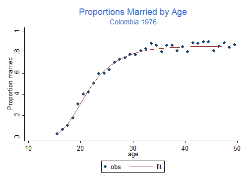

# 4 Programming Stata

This section is a gentle introduction to programming Stata. I discuss *macros* and *loops*, and show how to write your own (simple) programs. This is a large subject and all I can hope to do here is provide a few tips that hopefully will spark your interest in further study. However, the material covered will help you use Stata more effectively.

Stata 9 introduced a new and extremely powerful matrix programming language called *Mata*, and Stata 16 expanded the choice of languages by integrating Python. In addition, it is possible to write Stata plugins in C or Java. All of these languages are beyond the scope of this introductory tutorial. Your efforts here will not be wasted, however, because the options are complementary to, not a complete substitute for, classic Stata programming.

To learn more about programming Stata I recommend Kit Baum’s *An Introduction to Stata Programming*, now in its second edition, and William Gould’s *The Mata Book*. You may also find useful Chapter 18 in the *User’s Guide*, referring to the *Programming* volume and/or the online help as needed. Nick Cox’s regular columns in the *Stata Journal* are a wonderful resource for learning about Stata. Other resources were listed in Section 1 of this tutorial.

## 4.1 Macros

A macro is simply a name associated with some text. Macros can be local or global in scope.

### 4.1.1 Storing Text in Local Macros

Local macros have names of up to 31 characters and are known only in the current context (the console, a do file, or a program).

You *define* a local macro using `local name [=] text` and you *evaluate* it using ``name'`. (Note the use of a backtick or left quote.)

The first variant, without an equal sign, is used to store arbitrary text of up to ~64k characters (up to a million in Stata SE). The text is often enclosed in quotes, but it doesn’t have to be.

#### Example: Control Variables in Regression.

You need to run a bunch of regression equations that include a standard set of control variables, say `age`, `agesq`, `education`, and `income`. You could, of course, type these names in each equation, or you could cut and paste the names, but these alternatives are tedious and error prone. The smart way is to define a macro

```
local controls age agesq education income
```

You then type commands such as

```
regress outcome treatment `controls'
```

which in this case is exactly equivalent to typing `regress outcome treatment age agesq education income`.

If there’s only one regression to run you haven’t saved anything, but if you have to run several models with different outcomes or treatments, the macro saves work and ensures consistency.

This approach also has the advantage that if later you realize that you should have used log-income rather than income as a control, all you need to do is change the macro definition at the top of your do file, say to read `logincome` instead of `income` and all subsequent models will be run with income properly logged (assuming these variables exist).

*Warning*: Evaluating a macro that doesn’t exist is not an error; it just returns an empty string. So be careful to spell macro names correctly. If you type `regress outcome treatment `contrls'`, Stata will read `regress outcome treatment`, because the macro `contrls` does not exist. The same would happen if you type ``control'` because macro names cannot be abbreviated the way variable names can. Either way, the regression will run without any controls. But you always check your output, right?

#### Example: Managing Dummy Variables

Suppose you are working with a demographic survey where age has been grouped in five-year groups and ends up being represented by seven dummies, say `age15to19` to `age45to49`, six of which will be used in your regressions. Define a macro

```
local age "age20to24 age25to29 age30to34 age35to39 age40to44 age45to49"
```

and then in your regression models use something like

```
regress ceb `age' urban
```

which is not only shorter and more readable, but also closer to what you intend, which is to regress `ceb` on “age”, which happens to be a bunch of dummies. This also makes it easier to change the representation of age; if you later decide to use linear and quadratic terms instead of the six dummies all you do is define `local age "age agesq"` and rerun your models. Note that the first occurrence of `age` here is the name of the macro and the second is the name of a variable. I used quotes to make the code clearer. Stata never gets confused.

*Note on nested macros*. If a macro includes macro evaluations, these are resolved at the time the macro is created, not when it is evaluated. For example if you define `local controls `age' income education`. Stata sees that it includes the macro `age` and substitutes the current value of `age`. Changing the contents of the macro `age` at a later time does not change the contents of the macro `controls`.

There is, however, a way to achieve that particular effect. The trick is to escape the macro evaluation character when you define the macro, typing `local controls \`age' income education`. Now Stata does not evaluate the macro (but eats the escape character),so the contents of `controls` becomes ``age' income education`. When the `controls` macro is evaluated, Stata sees that it includes the macro `age` and substitutes its current contents.

In one case substitution occurs when the macro is defined, in the other when it is evaluated.

### 4.1.2 Storing Results in Local Macros

The second type of macro definition, `local name = text` with an equal sign, is used to store *results*. It instructs Stata to treat the text on the right hand side as an expression, evaluate it, and store a text representation of the result under the given name.

Suppose you just run a regression and want to store the resulting R-squared, for comparison with a later regression. You know that `regress` stores R-squared in `e(r2)`, so you think `local rsq e(r2)` would do the trick.

But it doesn’t. Your macro stored the formula `e(r2)`, as you can see by typing `display "`rsq'"`. What you needed to store was the value. The solution is to type `local rsq = e(r2)`, with an equal sign. This causes Stata to evaluate the expression and store the result.

To see the difference try this

```
. sysuse auto, clear
(1978 Automobile Data)

. quietly regress mpg weight

. local rsqf e(r2)

. local rsqv = e(r2)

. di `rsqf'       // this has the current R-squared
.65153125

. di `rsqv'       // as does this
.65153125

. quietly regress mpg weight foreign

. di `rsqf'       // the formula has the new R-squared
.66270291

. di `rsqv'       // this guy has the old one
.65153125
```

Another way to force evaluation is to enclose `e(r2)` in single quotes when you define the macro. This is called a *macro expression*, and is also useful when you want to display results. It allows us to type `display "R-squared=`rsqv'"` instead of `display "R-squared=" `rsq'`. (What do you think would happen if you type `display "``rsqf''"`?)

An alternative way to store results for later use is to use *scalars* (type `help scalars` to learn more.) This has the advantage that Stata stores the result in binary form without loss of precision. A macro stores a text representation that is good only for about 8 digits. The downside is that scalars are in the global namespace, so there is a potential for name conflicts, particular in programs (unless you use temporary names, which we discuss later).

You *can* use an equal sign when you are storing text, but this is not necessary, and is not a good idea if you are using an old version of Stata. The difference is subtle. Suppose we had defined the `controls` macro by saying `local controls = "age agesq education income"`. This would have worked fine, but the quotes cause the right-hand-side to be *evaluated*, in this case as a string, and strings used to be limited to 244 characters (or 80 in Stata/IC before 9.1), whereas macro text can be much longer. Type `help limits` to be reminded of the limits in your version.

### 4.1.3 Keyboard Mapping with Global Macros

Global macros have names of up to 32 characters and, as the name indicates, have global scope.

You *define* a global macro using `global name [=] text` and *evaluate* it using `$name`. (You may need to use `${name}` to clarify where the name ends.)

I suggest you avoid global macros because of the potential for name conflicts. A useful application, however, is to map the function keys on your keyboard. If you work on a shared network folder with a long name try something like this

```
global F5 \\server\shared\research\project\subproject\ 
```

Then when you hit F5 Stata will substitute the full name. And your *do* files can use commands like `do ${F5}dofile`. (We need the braces to indicate that the macro is called `F5`, not `F5dofile`.)

Obviously you don’t want to type this macro each time you use Stata. Solution? Enter it in your `profile.do` file, a set of commands that is executed each time you run Stata. Your profile is best stored in Stata’s start-up directory, usually `C:\data`. Type `help profilew` to learn more.

### 4.1.4 More on Macros

Macros can also be used to obtain and store information about the system or the variables in your dataset using *extended macro functions*. For example you can retrieve variable and value labels, a feature that can come handy in programming.

There are also commands to manage your collection of macros, including `macro list` and `macro drop`. Type `help macro` to learn more.

## 4.2 Looping

Loops are used to do repetitive tasks. Stata has commands that allow looping over sequences of numbers and various types of lists, including lists of variables.

Before we start, however, don’t forget that Stata does a lot of looping all by itself. If you want to compute the log of income, you can do that in Stata with a single line:

```
gen logincome = log(income)
```

This loops implicitly over all observations, computing the log of each income, in what is sometimes called a *vectorized* operation. You could code the loop yourself, but you shouldn’t because (i) you don’t need to, and (ii) your code will be a lot slower that Stata’s built-in loop.

### 4.2.1 Looping Over Sequences of Numbers

The basic looping command takes the form

```
forvalues number = sequence {
    ... body of loop using `number' ...
}
```

Here `forvalues` is a keyword, `number` is the name of a local macro that will be set to each number in the sequence, and `sequence` is a range of values which can have the form

- `min/max` to indicate a sequence of numbers from `min` to `max` in steps of one, for example `1/3` yields 1, 2 and 3, or
- `first(step)last` which yields a sequence from `first` to `last` in steps of size `step`. For example `15(5)50` yields 15,20,25,30,35,40,45 and 50.

(There are two other ways of specifying the second type of sequence, but I find the one listed here the clearest, see `help forvalues` for the alternatives.)

The opening left brace must be the last thing on the first line (other than comments), and the loop must be closed by a matching right brace on a line all by itself. The loop is executed once for each value in the sequence with your local macro `number` (or whatever you called it) holding the value.

#### Creating Dummy Variables

Here’s my favorite way of creating dummy variables to represent age groups. Stata 11 introduced factor variables and Stata 13 improved the labeling of tables of estimates, drastically reducing the need to “roll your own” dummies, but the code remains instructive.

```
forvalues bot = 20(5)45 {
    local top = `bot' + 4
    gen age`bot'to`top' = age >= `bot' & age <= `top'
}
```

This will create dummy variables `age20to24` to `age45to49`. The way the loop works is that the local macro `bot` will take values between 20 and 45 in steps of 5 (hence 20, 25, 30, 35, 40, and 45), the lower bounds of the age groups.

Inside the loop we create a local macro `top` to represent the upper bounds of the age groups, which equals the lower bound plus 4. The first time through the loop `bot` is 20, so `top` is 24. We use an equal sign to store the result of adding 4 to `bot`.

The next line is a simple generate statement. The first time through the loop the line will say `gen age20to24 = age >= 20 & age <= 24`, as you can see by doing the macro substitution yourself. This will create the first dummy, and Stata will then go back to the top to create the next one.

### 4.2.2 Looping Over Elements in a List

The second looping command is `foreach` and comes in six flavors, dealing with different types of lists. I will start with the generic list:

```
foreach item in a-list-of-things {
    ... body of loop using `item' ...
}
```

Here `foreach` is a keyword, `item` is a local macro name of your own choosing, `in` is another keyword, and what comes after is a list of blank-separated words. Try this example

```
foreach animal in cats and dogs {
    display "`animal'"
}
```

This loop will print “cats”, “and”, and “dogs”, as the local macro `animal` is set to each of the words in the list. Stata doesn’t know “and” is not an animal, but even if it did, it wouldn’t care because the list is generic.

If you wanted to loop over an irregular sequence of numbers –for example you needed to do something with the Coale-Demeny regional model life tables for levels 2, 6 and 12– you could write

```
foreach level in 2 6 12 {
    ... do something with `level' ...
}
```

That’s it. This is probably all you need to know about looping.

### 4.2.3 Looping Over Specialized Lists

Stata has five other variants of `foreach` which loop over specific types of lists, which I now describe briefly.

#### Lists of Variables

Perhaps the most useful variant is

```
foreach varname of varlist list-of-variables {
    ... body of loop using `varname' ...
}
```

Here `foreach`, `of` and `varlist` are keywords, and must be typed exactly as they are. The `list-of-variables` is just that, a list of *existing* variable names typed using standard Stata conventions, so you can abbreviate names (at your own peril), use `var*` to refer to all variables that start with “var”, or type `var1-var3` to refer to variables `var1` to `var3`.

The advantages of this loop over the generic equivalent `foreach varname in list-of-variables` is that Stata checks that each name in the list is indeed an existing variable name, and lets you abbreviate or expand the names.

If you need to loop over *new* as opposed to *existing* variables use `foreach varname of newlist list-of-new-variables`. The `newlist` keyword replaces `varlist` and tells Stata to check that all the list elements are legal names of variables that don’t exist already.

#### Words in Macros

Two other variants loop over the words in a local or global macro; they use the keyword `global` or `local` followed by a macro name (in lieu of a list). For example here’s a way to list the control variables from the section on local macros:

```
foreach control of local controls {
    display "`control'"
}
```

Presumably you would do something more interesting than just list the variable names. Because we are looping over variables in the dataset we could have achieved the same purpose using `foreach` with a `varlist`; here we save the checking.

#### Lists of Numbers

Stata also has a `foreach` variant that specializes in lists of numbers (or `numlists` in Stataspeak) that can’t be handled with `forvalues`.

Suppose a survey had a baseline in 1980 and follow ups in 1985 and 1995. (They actually planned a survey in 1990 but it was not funded.) To loop over these you could use

```
foreach year of numlist 1980 1985 1995 {
    display "`year'"
}
```

Of course you would do something more interesting than just print the years. The numlist could be specified as `1 2 3`, or `1/5` (meaning 1 2 3 4 5), or `1(2)7` (count from 1 to 7 in steps of 2 to get 1 3 5 7); type `help numlist` for more examples.

The advantage of this command over the generic `foreach` is that Stata will check that each of the elements of the list of numbers is indeed a number.

### 4.2.4 Looping for a While

In common with many programming languages, Stata also has a `while` loop, which has the following structure

```
while condition {
    ... do something ...
}
```

where condition is an expression. The loop executes as long as the condition is true (nonzero). Usually something happens inside the loop to make the condition false, otherwise the code would run forever.

A typical use of `while` is in iterative estimation procedures, where you may loop while the difference in successive estimates exceeds a predefined tolerance. Usually an iteration count is used to detect lack of convergence.

The `continue [,break]` command allows breaking out of any loop, including `while`, `forvalues` and `foreach`. The command stops the current iteration and continues with the next, unless `break` is specified in which case it exits the loop.

### 4.2.5 Conditional Execution

Stata also has an `if` programming command, not to be confused with the `if`*qualifier* that can be used to restrict any command to a subset of the data, as in `summarize mpg if foreign`. The `if`*command* has the following structure

```
if expression {
    ... commands to be executed if expression is true ...
}
else {
    ... optional block to be executed if expression is false ...
}
```

Here `if` and the optional `else` are keywords, type `help exp` for an explanation of expressions. The opening brace `{` must be the last thing on a line (other than comments) and the closing brace `}` must be on a new line by itself.

If the `if` or `else` parts consist of a single command they can go on the same line *without* braces, as in `if expression command`. But `if expression { command }` is not legal. You could use the braces by spreading the code into three lines and this often improves readability of the code.

So here we have a silly loop where we break out after five of the possible ten iterations:

```
forvalues iter=1/10 {
    display "`iter'"
    if `iter' >= 5 continue, break
}
```

And with that, we break out of looping.

## 4.3 Writing Commands

We now turn to the fun task of writing your own Stata commands. Follow along as we develop a couple of simple programs, one to sign your output, and another to evaluate the Coale-McNeil model nuptiality schedule, so we can create a plot like the figure below.



### 4.3.1 Programs With No Arguments

Let us develop a command that helps label your output with your name. (Usually you would want a timestamp, but that is already available at the top of your log file. You always log your output, right?) The easiest way to develop a command is to start with a *do* file. Fire up Stata’s do-file editor (Ctrl-9) and type:

```
capture program drop sign
program define sign
    version 9.1
    display as text "Germán Rodríguez "
    display "{txt}{hline 62}"
end
```

That’s it. If you now type `sign` Stata will display the signature using the text style (usually black on your screen).

The `program drop` statement is needed in case we make changes and need to rerun the do file, because you can’t define an existing program. The `capture` is needed the very first time, when there is nothing to drop.

The `version` statement says this command was developed for version 9.1 of Stata, and helps future versions of Stata run it correctly even if the syntax has changed in the interim.

The last line uses a bit of SMCL, pronounced “smickle” and short for Stata Markup Control Language, which is the name of Stata’s output processor. SMCL uses plain text combined with commands enclosed in braces. For example `{txt}` sets display mode to text, and `{hline 62}` draws a horizontal rule exactly 62 characters wide. To learn more about SMCL type `help smcl`.

### 4.3.2 A Program with an Argument

To make useful programs you will often need to pass information to them, in the form of “arguments” you type after the command. Let’s write a command that echoes what you say

```
capture program drop echo
program define echo
    version 9.1
    display as text "`0'"
end
```

Try typing `echo Programming Stata Tutorial` to see what happens.

When you call a command Stata stores the arguments in a local macro called `0`. We use a display command with ``0'` to evaluate the macro. The result is text, so we enclose it in quotes. (Suppose you typed `echo Hi`, so the local macro `0` has `Hi`; the command would read `display Hi` and Stata will complain, saying ‘Hi not found’. We want the command to read `display "Hi"`, which is why we code `display "`0'"`.)

If we don’t specify anything, the local macro `0` will be an empty string, the command will read `display ""` and Stata will print a blank line.

### 4.3.3 Compound Quotes

Before we go out to celebrate we need to fix a small problem with our new command. Try typing echo The hopefully “final” run. Stata will complain. Why? Because after macro substitution the all-important display command will read

```
display "The hopefully "final" run"
```

The problem is that the quote before final closes the initial quote, so Stata sees this is as `"The hopefully "` followed by `final" run"`, which looks to Stata like an invalid name. Obviously we need some way to distinguish the inner and outer quotes.

Incidentally you could see exactly where things went south by typing `set trace on` and running the command. You can see in (often painful) detail all the steps Stata goes through, including all macro substitutions. Don’t forget to type `set trace off` when you are done. Type `help trace` to learn more.

The solution to our problem? Stata’s *compound double quotes*: ``"` to open and `"'` to close, as in ``"compound quotes"'`. Because the opening and closing symbols are different, these quotes can be nested. Compound quotes

- *can* be used anywhere a double quote is used.
- *must* be used if the text being quoted includes double quotes.

So our program must `display `"`0'"'`. Here’s the final version.

```
program define echo
    version 9.1
    if `"`0'"' != "" display as text `"`0'"'
end
```

You will notice that I got rid of the `capture drop line`. This is because we are now ready to save the program as an *ado* file. Type `sysdir` to find out where your personal ado directory is, and then save the file there with the name `echo.ado`. The command will now be available any time you use Stata.

(As a footnote, you would want to make sure that there is no official Stata command called `echo`. To do this I typed `which echo`. Stata replied “command echo not found as either built-in or ado-file”. Of course there is no guarantee that they will not write one; Stata reserves all english words.)

### 4.3.4 Positional Arguments

In addition to storing all arguments together in local macro `0`, Stata parses the arguments (using white space as a delimiter) and stores all the words it finds in local macros `1`, `2`, `3`, etc.

Typically you would do something with ``1'` and then move on to the next one. The command `mac shift` comes handy then, because it shifts all the macros down by one, so the contents of `2` is now in `1`, and `3` is in `2`, and so on. This way you always work with what’s in `1` and shift down. When the list is exhausted `1` is empty and you are done.

So here is the canonical program that lists its arguments

```
capture program drop echo
program define echo
    version 9.1
    while "`1'" != "" {
        display `"`1'"'
        mac shift
    }
end
```

Don’t forget the `mac shift`, otherwise your program may run forever. (Or until you hit the break key.)

Try `echo one two three testing`. Now try `echo one "two and three" four`. Notice how one can group words into a single argument by using quotes.

This method is useful, and sometimes one can given the arguments more meaningful names using `args`, but we will move on to the next level, which is a lot more powerful and robust.

(By the way one can pass arguments not just to commands, but to *do* files as well. Type `help do` to learn more.)

### 4.3.5 Using Stata Syntax

If your command uses standard Stata syntax, which means the arguments are a list of variables, possibly a weight, maybe an `if` or `in` clause, and perhaps a bunch of *options*, you can take advantage of Stata’s own parser, which conveniently stores all these elements in local macros ready for you to use.

#### A Command Prototype

Let us write a command that computes the probability of marrying by a certain age in a Coale-McNeil model with a given mean, standard deviation, and proportion marrying. The syntax of our proposed command is

```
pnupt age, generate(married) [ mean(25) stdev(5) pem(1)]
```

So we require an existing variable with age in exact years, and a mandatory option specifying a new variable to be generated with the proportions married. There are also options to specify the mean, the standard deviation, and the proportion ever married in the schedule, all with defaults. Here’s a first cut at the command

```
capture program drop pnupt
program define pnupt
    version  9.1
    syntax varname, Generate(name) ///
        [ Mean(real 25) Stdev(real 5) Pem(real 1) ]
    // ... we don't do anything yet ...
end
```

The first thing to note is that the `syntax` command looks remarkably like our prototype. That’s how easy this is.

#### Variable Lists

The first element in our syntax is an example of a *list of variables* or `varlist`. You can specify minima and maxima, for example a program requiring exactly two variables would say `varlist(min=2 max=2)`. When you have only one variable, as we do, you can type `varname`, which is short for `varlist(min=1 max=1)`.

Stata will then make sure that your program is called with exactly one name of an existing variable, which will be stored in a local macro called `varlist`. (The macro is always called `varlist`, even if you have only one variable and used `varname` in your syntax statement.) Try `pnupt nonesuch` and Stata will complain, saying “variable nonesuch not found”.

(If you have done programming before, and you spent 75% of your time writing checks for input errors and only 25% focusing on the task at hand, you will really appreciate the `syntax` command. It does a lot of error checking for you.)

#### Options and Defaults

Optional syntax elements are enclosed in square brackets `[` and `]`. In our command the `generate` option is required but the other three are optional. Try these commands to generate a little test dataset with an age variable ranging from 15 to 50

```
drop _all
set obs 36
gen age = 14 + _n
```

Now try `pnupt age`. This time Stata is happy with `age` but notes ‘option generate() required’. Did I say `syntax` saves a lot of work? Options that take arguments need to specify the type of argument (`integer`, `real`, `string`, `name`) and, optionally, a default value. Our `generate` takes a `name`, and is required, so there is no default. Try `pnupt age, gen(2)`. Stata will complain that 2 is not a name.

If all is well, the contents of the option is stored in a local macro with the same name as the option, here `generate`.

#### Checking Arguments

Now we need to do just a bit of work to check that the name is a valid variable name, which we do with `confirm`:

```
confirm new variable `generate'
```

Stata then checks that you could in fact generate this variable, and if not issues error 110. Try `pnupt age, gen(age)` and Stata will say ‘age already defined’.

It should be clear by now that Stata will check that if you specify a mean, standard deviation or proportion ever married, abbreviated as `m()`, `s()` and `p()`, they will be real numbers, which will be stored in local macros called `mean`,, `stdev`, and `pem`. If an option is omitted the local macro will contain the default.

You could do more checks on the input. Let’s do a quick check that all three parameters are non-negative and the proportion is no more than one.

```
if (`mean' <= 0 | `stdev' <= 0 | `pem' <= 0 | `pem' > 1) {
    di as error "invalid parameters"
    exit 110
}
```

You could be nicer to your users and have separate checks for each parameter, but this will do for now.

#### Temporary Variables

We are now ready to do some calculations. We take advantage of the relation between the Coale-McNeil model and the gamma distribution, as explained in Rodríguez and Trussell (1980). Here’s a working version of the program

```
program define pnupt
*! Coale-McNeil cumulative nuptiality schedule v1 GR 24-Feb-06
    version 9.1
    syntax varname, Generate(name) [Mean(real 25) Stdev(real 5) Pem(real 1)]
    confirm new var `generate'
    if `mean' <= 0 | `stdev' <= 0 | `pem' <= 0 | `pem' > 1 {
        display as error "invalid parameters"
        exit 198
    }
    tempname z g
    gen `z' = (`varlist' - `mean')/`stdev'
    gen `g' = gammap(0.604, exp(-1.896 * (`z' + 0.805)))
    gen `generate' = `pem' * (1 - `g') 
end 
```

We could have written the formula for the probability in one line but only by sacrificing readability. Instead we first standardize age, by subtracting the mean and dividing by the standard deviation. What can we call this variable? You might be tempted to call it `z`, but what if the user of your program has a variable called `z`? Later we evaluate the gamma function. What can we call the result?

The solution is the `tempname` command, which asks Stata to make up unique temporary variable names, in this case two to be stored in local macros `z` and `g`. Because these macros are local, there is no risk of name conflicts. Another feature of temporary variables is that they disappear automatically when your program ends, so Stata does the housekeeping for you.

The line `gen `z' = (`varlist' - `mean')/`stdev'` probably looks a bit strange at first. Remember that all quantities of interest are now stored in local macros and we need to evaluate them to get anywhere, hence the profusion of backticks: ``z'` gets the name of our temporary variable, ``varlist'` gets the name of the age variable specified by the user, ``mean'` gets the value of the mean, and ``stdev'` gets the value of the standard deviation. After macro substitution this line will read something like `gen _000001 = (age-22.44)/5.28`, which probably makes a lot more sense.

#### If/In

You might consider allowing the user to specify `if` and `in` conditions for your command. These would need to be added to the syntax, where they would be stored in local macros, which can then be used in the calculations, in this case passed along to generate.

For a more detailed discussion of this subject type `help syntax` and select `if` and then `in`. The entry in `help mark` is also relevant.

### 4.3.6 Creating New Variables

Sometimes all your command will do is create a new variable. This, in fact, is what our little command does. Wouldn’t it be nice if we could use an `egen` type of command like this:

```
egen married = pnupt(age), mean(22.48) stdev(5.29) pem(0.858)
```

Well, we can! As it happens, `egen` is user-extendable. To implement a function called `pnupt` you have to create a program (ado file) called `_gpnupt`, in other words add the prefix `_g`. The documentation on egen extensions is a bit sparse, but once you know this basic fact all you need to do is look at the source of an `egen` command and copy it. (I looked at `_gmean`.)

So here’s the `egen` version of our Coale-McNeil command.

```
program define _gpnupt
*! Coale-McNeil cumulative nuptiality schedule v1 GR 24-Feb-06
    version 9.1
    syntax newvarname=/exp [, Mean(real 25) Stdev(real 5) Pem(real 1)]
    if `mean' <= 0 | `stdev' <= 0 | `pem' <= 0 | `pem' > 1 {
        display as error "invalid parameters"
        exit 198
    }
    tempname z g
    gen `z' = (`exp' - `mean')/`stdev'
    gen `g' = gammap(0.604, exp(-1.896 * (`z' + 0.805)))
    gen `typlist' `varlist' = `pem' * (1 - `g') 
end 
```

There are very few differences between this program and the previous one. Instead of an input variable `egen` accepts an expression, which gets evaluated and stored in a temporary variable called `exp`. The output variable is specified as a `varlist`, in this case a `newvarname`. That’s why `z` now works with `exp`, and `gen` creates `varlist`. The mysterious `typlist` is there because `egen` lets you specify the type of the output variable (`float` by default) and that gets passed to our function, which passes it along to `gen`.

### 4.3.7 A Coale-McNeil Fit

We are ready to reveal how the initial plot was produced. The data are available in a Stata file in the demography section of my website, which has counts of ever married and single women by age. We compute the observed proportion married, compute fitted values based on the estimates in Rodríguez and Trussell (1980), and plot the results. It’s all done in a handful of lines

```
. use https://data.princeton.edu/eco572/datasets/cohhnupt, clear
(WFS Colombia Household Survey)

. gen agem = age + 0.5

. gen obs = ever/total

. egen fit = pnupt(agem), mean(22.44) stdev(5.28) pem(.858)

. twoway (scatter obs agem) (line fit agem), ///
>     title(Proportions Married by Age) subtitle(Colombia 1976) ///
>     ytitle(Proportion married) xtitle(age)

. graph export cchhnup.png,     width(500) replace
(file cchhnup.png written in PNG format)
```

The actual estimation can be implemented using Stata’s maximum likelihood procedures, but that’s a story for another day.

## 4.4 Other Topics

To keep this tutorial short I haven’t discussed returning values from your program, type `help return` to learn more. For related subjects on estimation commands, which can post estimation results, see `help ereturn` and `help _estimates`. An essential reference on estimation is *Maximum Likelihood Estimation with Stata*, Fourth Edition, by Gould, Pitblado and Poi (2010).

Other subjects of interest are matrices (start with `help matrix`), and how to make commands “byable” (type `help byable`). To format your output you need to learn more about SMCL, start with `help smcl`. For work on graphics you may want to study class programming (`help class`) and learn about sersets (`help serset`). To provide a graphical user interface to your command try `help dialog programming`. It is also possible to read and write text and binary files (see `help file`).

The biggest omission is Mata, a full-fledged matrix programming language that was introduced in Version 9 of Stata. Mata is compiled to byte code, so it is much faster than Stata’s classic ado programs. I find that the best way to write new Stata commands is to use classic ado for the user interface and Mata for the actual calculations. If you are interested in learning Mata I strongly recommend Gould’s (2018) *The Mata Book*.